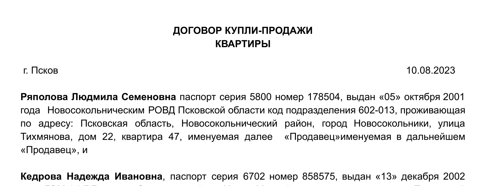
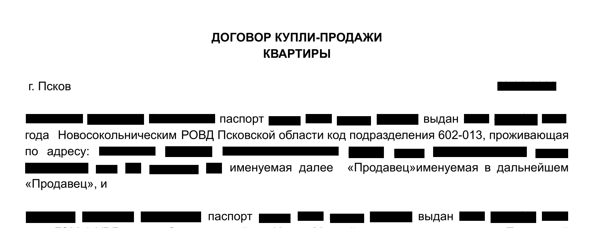

# 1. Цель проекта
-----

Цель проекта — разработать систему позволяющую автоматизировано обезличивать персональные данные пользователей в документах, для последующей прередачи их на стороний аудит.

Так как документы могут хранится в разных форматах файлов, необходимо разработать алгоритм позволяющий работать с самымми распространнеными из них:
1. pdf
2. png, jpg, jpeg
3. docx

# 2.  Описание системы
-----
Система содержит следующий функциональные блоки:
1.  Загрузка файлов допустимых форматов
2.  Выбор типа документов 
3.  Маскировка данных

## 2.1 Загрузка файлов
----
Данные передаются с фронтенда на бекенд в виде в байтового потока. После обработки файла, он должен также переводиться в байтовый поток и возвращаться на фронтенд, откуда передается обратно пользователю.

## 2.2 Выбор типа документа
----
Для стандартных банковских документов (договоров, открытие расчетного счета, платежные поручения и т.д. ) допустим любой формат данных

Для документов удостоверяющих личность (пасспорт, водительское удостоверение, снилс) допустимы только форматы - png, jpg, jpeg

## 2.3 Алгоритм маскировки данных
----
Для определения данных которые необходимо замаскировать будут использованы регулярные выражения совместно с движком оптического распознавания символов.

С помощью оптического распознования символов, будет получены текст и его расположение, после данные сравниваются с форматом записанным регулярным выражением и из этого делается вывод о необходимости их маскировки.

# 3. Стек технолоигй
----
Для реализации системы был использован следующий стек технологий:

- Бэкенд:
	- Язык Python
	- Фреймворк FastAPI
	- OpenCV
	- Tesseract
- Фронтенд:
	- React
	- JavaScript
- Дизайн:
	- Adobe Photoshop
	- Figma

# 4. Пример работы

Входные данные (png формат): 

Результат работы алгоритма:

После работы алгоритма с файла были удалены следующие персональные данные:
	1. ФИО
	2. серия, номер паспорта, а также дата выдачи
	3. адрес проживания
